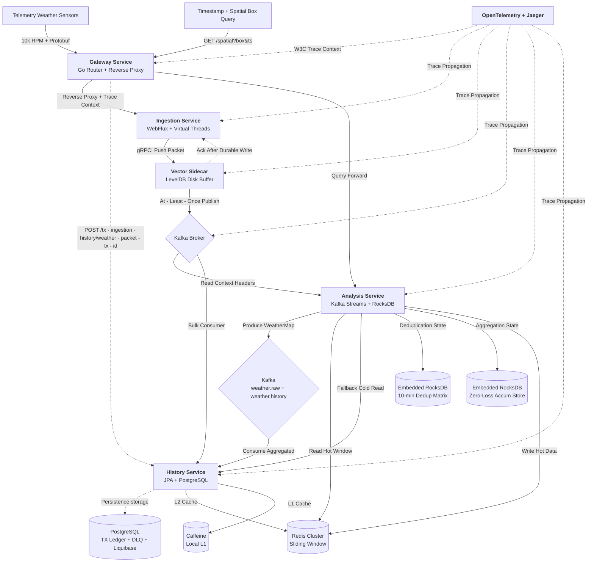
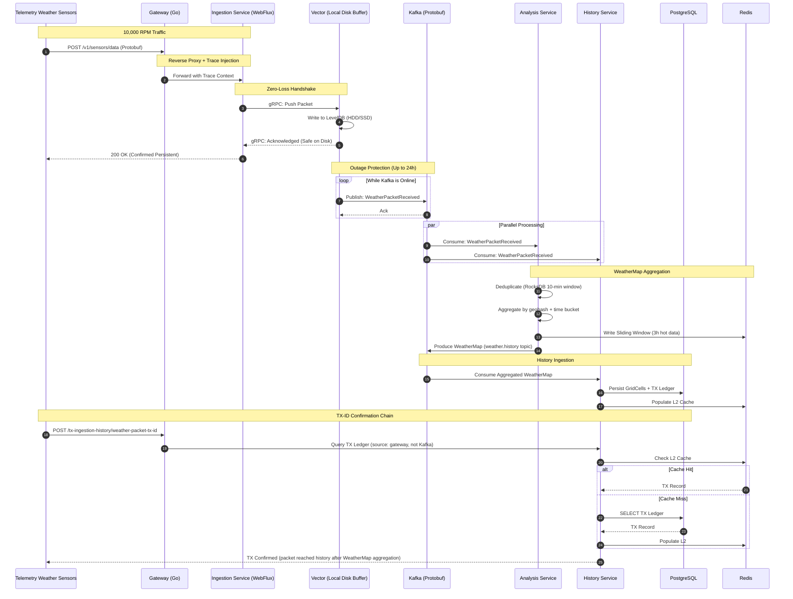
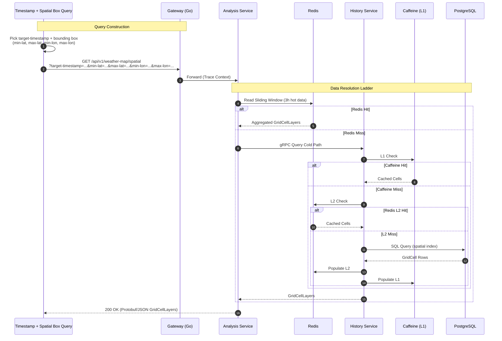

# Eco Monitoring Platform

[](https://opensource.org)
[](https://oracle.com)
[](https://go.dev)
[](https://docker.com)

A high-performance, polyglot microservices platform designed for environmental and weather telemetry data ingestion,
real-time analytics, and historical storage. It processes **10k+ RPM** of sensor readings from distributed weather
stations, aggregates them into spatial grid cells using Kafka Streams, and exposes them via a unified Go API gateway.

---

## ⚡ Quick Start & Live Telemetry

Launch the entire platform, spin up production-grade load simulations, and monitor active system metrics instantly
through a single command pipeline.

### 1. Initialize Environment Configurations

Before booting the platform, initialize the target environment configurations by stripping the `.example` postfix or
copying the files within their respective directories.

> ⚠️ **Important Network Requirement:** Do not use `localhost` for container-to-host or cross-service bridge
> communication. You must configure your actual local network IP (e.g., `192.168.1.50`) where noted below.

```bash
# Clone the repository
git clone https://github.com/NeoBliz1/eco-monitoring-platform.git
cd eco-monitoring-platform

# 1. Main root configurations
cp .env.example .env

# 2. Main docker environments (⚠️ Configure: HOST_IP=your_local_ip)
cp docker/.env.example docker/.env

# 3. Vault component environments
cp docker/compose/vault/.env.example docker/compose/vault/.env

# 4. Gateway network configurations (⚠️ Configure: SERVER_HOST=your_local_ip)
cp gateway-service/.env.example gateway-service/.env

# [Optional] Only required if running or debugging individual modules directly from an IDE:
cp dev_creds.env.example dev_creds.env
```

### 2. Configure End-to-End Tracing (Optional)

To activate distributed telemetry across the cluster routing hops, update the API gateway properties managed by Consul:

* Open `docker/compose/consul/platform-gateway-properties.yaml`
* Ensure the tracing toggle is explicitly enabled:
  ```yaml
  request_trace_enabled: true
  ```

### 3. Launch the Platform Orchestrator

Navigate to the deployment matrix and run the orchestrator script. To explore all configuration routines and execution
toggles, run `./run-platform.sh -help`.

```bash
cd docker/deployments/

# Compile all modules, spin up full infrastructure, and clear stale logs
# (Note: We omit '-noTrace' to allow end-to-end OpenTelemetry trace generation)
./run-platform.sh -cl
```

*💡 **Pro-Tip:** The `-cl` flag systematically purges all historic datastore logs and clickhouse records from previous
test runs to establish a clean monitoring matrix baseline.*

### 4. Inject Production Load Simulation

Execute the primary JMeter stress test matrix to generate live field telemetry and high-frequency spatial tracking
lookups simultaneously:

```bash
cd ../../bin/jmeter/
./run_prod_test.sh eco_stress_test.jmx
```

### 5. Open the Telemetry Mission Control

Click the deep links below to instantly monitor the running cluster inside **Grafana**, **Consul**, and **Jaeger**:

* 📜 *
  *[Master Log Stream Matrix](http://localhost:3000/d/eco-platform-master-logs/f09f939c-eco-platform-master-log-stream-matrix?orgId=1&from=now-24h&to=now&timezone=browser&refresh=5s)
  ** — Live log aggregator rolling across all polyglot microservices.
* ⚡ *
  *[Go API Gateway Edge Performance](http://localhost:3000/d/eco-platform-go-gateway-edge-performance/b307b29?orgId=1&from=now-6h&to=now&timezone=browser&refresh=5s)
  ** — Live edge routing diagnostics, reverse proxy latency metrics, and throughput.
* 📥 *
  *[Ingestion Service Performance](http://localhost:3000/d/eco-ingestion-service-performance/cf3ee71?orgId=1&from=now-6h&to=now&timezone=browser)
  ** — Reactive Spring WebFlux thread profiles and Vector LevelDB sidecar handshake rates.
* 🧠 *
  *[Analysis (Redis & RocksDB) Performance](http://localhost:3000/d/eco-analysis-redis-rocks-performance/8e2ea37?orgId=1&from=now-6h&to=now&timezone=browser&refresh=5s)
  ** — Deduplication window state metrics, state store flushes, and sliding window cache hits.
* 🗄️ *
  *[History Storage Performance](http://localhost:3000/d/eco-history-service-performance/4fee1b2?orgId=1&from=now-6h&to=now&timezone=browser)
  ** — Cold-path resolution latency matrix, Hibernate L2 statistics, and multi-tier read responses.
* 🕸️ **[Consul Service Registry Discovery](http://localhost:8500/ui/dc1/services)** — Real-time health validation and
  service discovery indexing for cluster microservices.
* 🕵️ **[Jaeger Distributed Trace Analyzer](http://localhost:16686/search)** — End-to-End W3C trace visualization across
  context-propagated routing hops.

## 🛠️ Orchestrator Configuration Interface Flags

The platform deployment compiler provides an extensive set of routing and runtime profile configuration flags:

| Flag                     | Parameter Type   | Functional Operations Description                                                     |
|:-------------------------|:-----------------|:--------------------------------------------------------------------------------------|
| `-help`                  | Help Guide       | Displays the interactive architectural routing helper menu.                           |
| `-cl`                    | Log Management   | Purges and clears log files before executing new runtime windows.                     |
| `-rt`                    | Compilation      | Forces Maven to run comprehensive test suites during module compilation.              |
| `-ddi`                   | Hot State        | Skips infrastructure teardown to keep existing Docker container states alive.         |
| `-noTrace`               | Telemetry Opts   | Disables OpenTelemetry tracing agents and dynamic aspect weaver configurations.       |
| `-dis` / `-das` / `-dhs` | Exclusive Target | Isolates building and deploying a *single* service (Ingestion, Analysis, or History). |
| `-xis` / `-xas` / `-xhs` | JDWP Debugging   | Mounts remote debugging configurations on ports `5005`/`5006`/`5007` (`suspend=y`).   |

---

## 🏗️ Architecture & Component Interaction

The platform uses an advanced event-driven topology engineered for zero-loss ingestion, multi-level caching, and strict
data persistence guarantees.



<details>
<summary>🔄 Click to view detailed Request & Query Sequence Diagrams</summary>

### Request Pipeline Flow



### Spatial Query Flow



</details>
## 🧰 Microservice Infrastructure

| Module              | Stack                                 | Core Responsibility                                                              |
|---------------------|---------------------------------------|----------------------------------------------------------------------------------|
| `gateway-service`   | **Go 1.22** • Consul • OpenTelemetry  | High-performance reverse-proxy edge routing with dynamic routing topologies.     |
| `ingestion-service` | **Java 21** • Spring WebFlux • Vector | Reactive endpoints processing Protobuf streams with zero-loss disk buffering.    |
| `analysis-service`  | **Java 21** • Kafka Streams • RocksDB | Deduplicates data windows and aggregates telemetry indices by spatial geohash.   |
| `history-service`   | **Java 21** • JPA • Caffeine + Redis  | Handles cold-path persistence, transaction ledgers, and multi-tier read queries. |

### System Specifications & Tooling

* **Stream Pipeline:** Kafka 4.3.0 (`exactly_once_v2`) • Confluent Schema Registry • RocksDB State Stores
* **Databases & Cache:** PostgreSQL 15+ (Spatial Indexes via Liquibase) • ClickHouse • Redis Cluster • Caffeine L1
* **Security & Lifecycle:** HashiCorp Vault (AppRole dynamic tokens) • RAM-isolated `tmpfs` volume secrets
* **Observability:** Unified W3C context tracing across Prometheus, Grafana, and Jaeger engine meshes

---

## 🏎️ Kafka Streams Pipeline

The Analysis service builds a highly resilient transactional processing stream divided into three specific phases:

```
Kafka (telemetry.live) ──► 1. Deduplication (RocksDB WindowStore) ──► 2. Spatial Repartition (Geohash Key) ──► 3. Aggregation (Sliding Redis Window) ──► Kafka (weather.history)
```

* **Deduplication Matrix:** Uses a `DEDUPLICATE_ROCKS_DB` persistent store running on a 10-minute slide pattern to
  identify and filter duplicate operations using unique transaction keys.
* **Spatial Alignment:** Automatically applies a localized partition system using custom calculated coordinate grids:
  `getGeohash(clampLatitude(lat), clampLongitude(lon))`.
* **Zero-Loss State Accumulation:** Relies on structural `STREAM_TIME` punctuations that continuously sweep the state
  stores up to the active system window processing boundary (`ZERO_LOSS_ACCUMULATION_STORE`).

---

## 🌐 Endpoints & Gateway Routes

### Core API Contracts

#### Telemetry Ingestion Pipeline

```http
POST /api/v1/telemetry/mono
Content-Type: application/x-protobuf
```

#### E2E Ingestion Verification Ledger

```http
POST /api/v1/tx-ingestion-history/weather-packet-tx-id
Content-Type: application/x-protobuf
```

#### Geospatial Sliding Bounding-Box Query

```http
GET /api/v1/weather-map/spatial?target-timestamp={ms}&min-lat={lat}&max-lat={lat}&min-lon={lon}&max-lon={lon}
```

### Exposed Platform Ports

* **API Gateway Router:** `http://localhost:8000`
* **Swagger OpenAPI UI Engine:** `/swagger-ui.html` on ports `8081`, `8082`, `8083`
* **Infrastructure Admin UI Ecosystem:** Consul (`8500`) • Vault (`8200`) • Grafana (`3000`) • Jaeger Trace Analyzer (
  `16686`)

---

## 🧪 Testing & Framework Verification

```bash
mvn test         # Executes core component unit testing suites
mvn verify       # Triggers advanced Failsafe multi-tier docker integration tests
```

The system features advanced automated integration scripts and production-scale performance harnesses using separate
runs for integration validations (`TelemetryInvocationControllerIT.java`) with built-in retry mechanisms.

---

## 💎 Advanced Design Frameworks

* **Zero-Loss Edge Buffer Engine:** The ingestion framework drops raw frames onto an isolated Vector sidecar system
  logging schema backed directly by LevelDB. This provides up to **24 hours of data isolation** during active
  down-stream service disruptions.
* **Synchronous End-to-End Validation:** The validation layer leverages transaction isolation verification patterns by
  testing records directly out of historical datastores bypassing stream processors entirely to prevent synthetic
  positive feedback metrics.
* **Kafka Streams Topology Isolation:** The topology orchestrator wires three isolated stages: deduplication (
  WindowStore), spatial repartition (geohash key), and aggregation (KeyValueStore + STREAM_TIME punctuation). Each stage
  maps its own persistent RocksDB store, and all writes execute under strict transactional (`exactly_once_v2`)
  guarantees.
* **Zero-Loss Accumulation Store:** The aggregation processor stores raw packets in `ZERO_LOSS_ACCUMULATION_STORE` keyed
  by `bucketMillis|geohash|txId`. On punctuation, the processor range-scans up to the previous window floor, groups
  packets by bucket + spatial key, forwards aggregated WeatherMap records, and deletes processed keys — guaranteeing no
  packet is dropped even if flushing is delayed.
* **Sliding Window Hot Data:** The Analysis Service writes aggregated metrics to Redis with a 3-hour sliding window on
  every processed packet, providing sub-millisecond query latency for spatial box queries without waiting for a stream
  window flush.
* **Multi-Level Caching Topology:** The History Service uses Caffeine (local L1) + Redis/Redisson (distributed L2) +
  Hibernate L2 cache, minimizing PostgreSQL load on cold-path spatial reads and TX-ID lookups.
* **Match-Aware Spatial Sampling:** The spatial query load generator implements a two-phase strategy: rejection sampling
  to find a bounding box that isolates a known coordinate, with a hardened fallback that centers the box on a randomly
  chosen registered point. This guarantees valid query hits against real ingested data rather than empty grid cells.
* **Ephemeral Memory Secret Spaces:** Boot token keys and security assets live strictly inside dynamic non-persistent
  virtual filesystems (`tmpfs`) that are systematically programmatically destroyed by cleanup tasks upon microservice
  verification.

---

## 📄 License

This repository is distributed under the terms of the [MIT License](LICENSE).

Copyright © 2026 Ilya (`neobliz1`).
